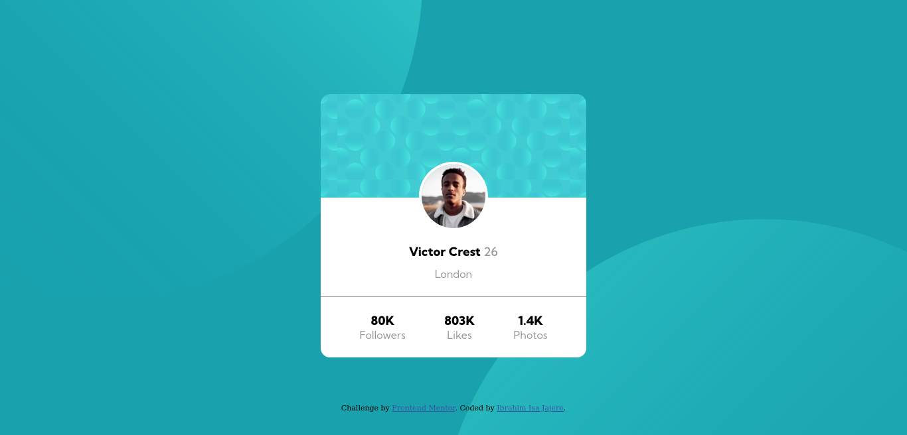
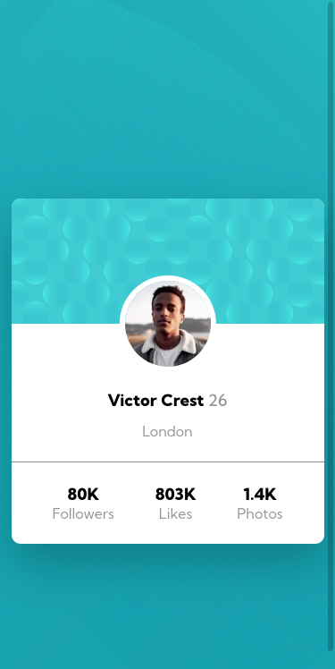

# Frontend Mentor - Profile card component solution

This is a solution to the [Profile card component challenge on Frontend Mentor](https://www.frontendmentor.io/challenges/profile-card-component-cfArpWshJ). Frontend Mentor challenges help you improve your coding skills by building realistic projects. 

## Table of contents

- [Overview](#overview)
  - [The challenge](#the-challenge)
  - [Screenshot](#screenshot)
  - [Links](#links)
- [My process](#my-process)
  - [Built with](#built-with)
  - [What I learned](#what-i-learned)
  - [Useful Resources](#useful-resources)
  - [Acknowledgements](#acknowledgements)
- [Author](#author)

## Overview

### The challenge

- Build out the project to the designs provided

### Screenshot

### Links

- Solution URL: [Github](https://github.com/ibrahimisa/profile-card-component-main.git)
- Live Site URL: [Netlify](https://hopeful-lalande-6a2beb.netlify.app/)

## My process

### Built with

- Semantic HTML5 markup
- Flexbox
- CSS Grid

### What I learned

- I learned how add multiple background images and how to position them.

### Useful Resources

- [Multiple background-image](https://developer.mozilla.org/en-US/docs/Web/CSS/background-image)
- [Background position](https://developer.mozilla.org/en-US/docs/Web/CSS/background-position)

### Acknowledgements

- I would like to mention peoples solutions that helped me figure out how takle certain proplems.  
  - [@MonaElshikh](https://www.frontendmentor.io/solutions/responsive-profile-card-using-flex-box-49BJwMgLC)
  - [@shrewdmind](https://www.frontendmentor.io/solutions/profile-card-component-ApYR_fZNl)

## Author

- Frontend Mentor - [@ibrahimisa](https://www.frontendmentor.io/profile/ibrahimisa)
- Twitter - [@Ibrahim_Isa274](https://www.twitter.com/Ibrahim_Isa274)
